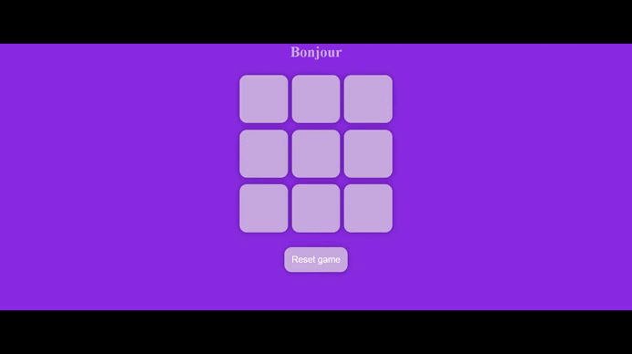

# Morpion Num&Boost

<br>

coolors for color(site),
```
Emmets : main>h1+div.game>button.box*9
```
**vmin:** vmin is specifically relative to the viewport and chooses the smaller of its two dimensions(h600 w800 = 1vmin = 6px).<br>

**% percentage:** typically relative to the parent elements size<br>

**px:** 30px looks same on mobile and laptop<br>

**em:** relative to parent element, the meaning of an em changes as elements are nested. 

```html
    <div> 16px
        <p> 2em (32px)
        <p> 0.5em(8px)
```
**rem == root elment :** relative to `<html>` or browser beyond which is 16px. if we set accordingly then adapts

```html
    <html> default == 16px
        2rem == 32px
```

js Concatenation ( + operator) always results in string. If an object is involved, its toString( ) method implicitly called.
```js
// here its a string and object concatenation. Default Object.prototype.toString()
console.log(`ebyid :` + testResetBtn); //ebyid :[object HTMLButtonElement]

// multiple arguments , , ,
// console.log(string, object, anotherObject)
console.log(`ebyid :`, testResetBtn);
```
2darray
```js
let arr2d = [["apple", "banana"], ["potato", "cabbage"], ["pants", "shirts"]]
arr2d[0][0]

```